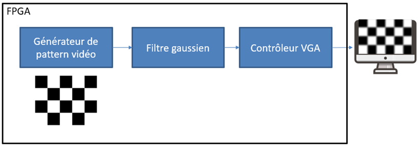
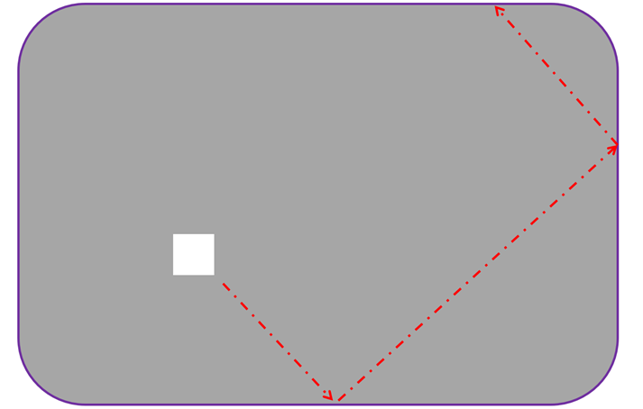
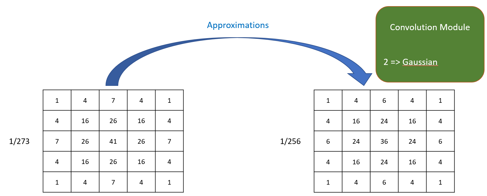

# TPs & PROJET de ma formation FPGA

## TP1 - Full Adder
## TP2 - Compteur - Clignotement d'une LED
## TP3 - Machine à états
## TP4 - Partie 1: Pilotage de LEDs
## TP4 - Partie 2: Pilotage de LEDs et Mémoire (utilisation de FIFO)
## TP5 - Domaines d'horloge (utilisation de PLL)
## Projet1 - Réalisation d'une IP de traitement d'image sur cible Zynq7020 avec affichage VGA (2D convolution - kernel 3x3)

## Projet2 - Déplacement d'un carré dans un écran VGA

## Projet3 - 2D convolution avec un filtre de Gauss de taille 5x5

## ANNEXE
### Matériel utilisé :
* Carte CoraZ7 (Xilinx)
* Carte Pmod VGA (Digilent)
* Oscilloscope Hantek
### Logiciel utilisé :
* Langage VHDL
* VIVADO
* LTspice
